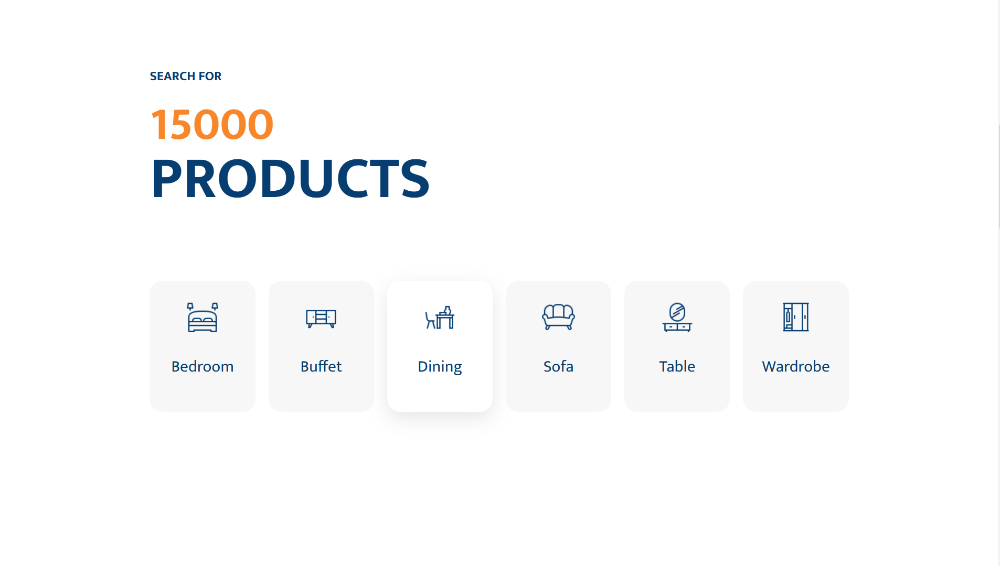

# 🛋️ The Furniture Website

Welcome to **The Furniture Website**! This project showcases a beautifully designed website for a furniture store, featuring various sections such as products, pricing, blog, and contact.

---

## 🌐 Live Demo

Check out the live version of the website at: [The Furniture Website](https://bothsann.github.io/thefurniture-website/)

---

## 🌟 Features

- **Hero Section**: A stunning hero banner with a background image and call-to-action buttons.
- **Products Section**: Display of different furniture categories with icons and images.
- **Pricing Section**: Detailed pricing cards for various furniture items.
- **Blog Section**: Latest trends and articles related to furniture.
- **Contact Section**: Newsletter subscription form for users to stay updated.
- **Responsive Design**: Fully responsive design that looks great on all devices.

---

## 📸 Screenshots





---

## 🛠️ Technologies Used

- **HTML5**: For the structure of the website.
- **CSS3**: For styling and layout.

---

## Setup Instructions 🛠️

1. Clone this repository to your local machine.
   ```bash
   git clone https://github.com/BothSann/thecreative-website.git

---

## 👨‍🍳 Author

© Copyright by **THANN SOPHEAKBOTH** - *Creator of the project*

---

## ⭐️ Don't forget to give this project a star if you like it!
